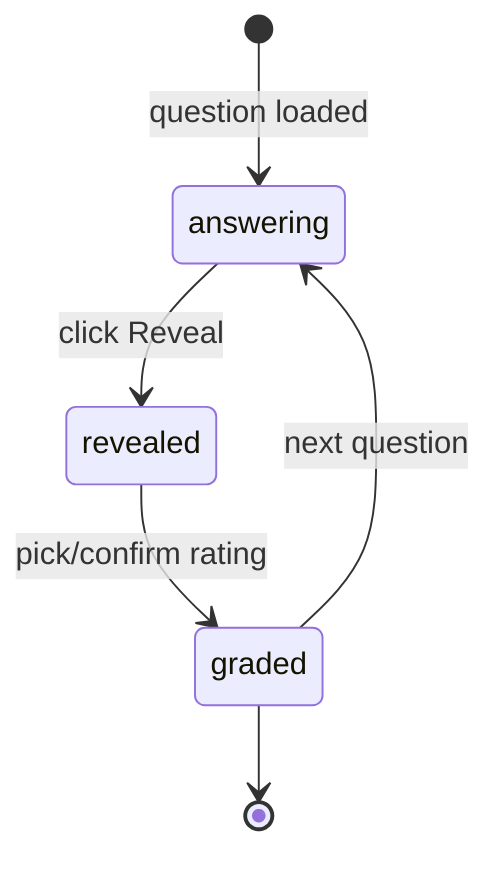
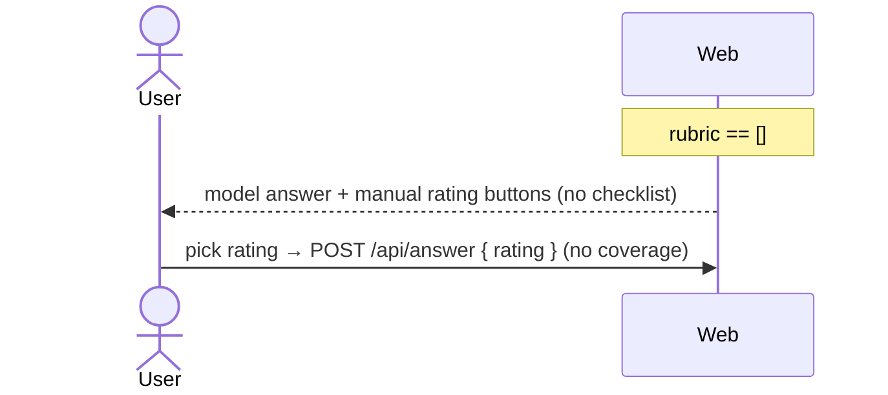

# Flow: Checklist Reveal → Self-Grade (practice)

The per-question self-grading flow added to normal practice (`app/practice`). On reveal, the question's checklist (rubric) becomes tickable; coverage % auto-suggests the spaced-repetition rating. See `issues/003-checklist-ui-rating.md`, decision #2.

## Actors

| Actor | Role |
|-------|------|
| User | Learner self-assessing |
| Web | `app/practice/page.tsx` + `components/RevealPanel` + new `ChecklistGrade` |
| Server | `api/generate` (returns rubric), `api/answer` (records rating + coverage) |
| DB | SQLite via Prisma (`Question.rubric`, `Attempt`, `TopicProgress`) |

## State Machine — Question attempt (client)



## Sequence — Happy Path (question has a checklist)

```mermaid
sequenceDiagram
    actor User
    participant Web
    participant Server
    participant DB

    Web->>Server: POST /api/generate { topicSlug, type }
    Server->>DB: pick question (prefer unseen)
    Server-->>Web: 200 { id, prompt, choices, referenceAnswer, rubric[] }
    Web-->>User: prompt + AnswerInput

    User->>Web: click Reveal
    Web-->>User: model answer + ChecklistGrade (rubric items, unticked)

    User->>Web: tick covered items
    Note over Web: coverage% = checked/total; suggest rating (<40 Again, 40–80 Good, >80 Easy)
    Web-->>User: highlight suggested rating (overridable)

    User->>Web: confirm or override rating
    Web->>Server: POST /api/answer { questionId, rating, coverage }
    Server->>DB: INSERT Attempt(score, feedback{rating,coverage}); UPDATE TopicProgress(nextDue, avg)
    Server-->>Web: 200 ok
    Web->>Server: POST /api/generate (next)
```

## Branches & Error Paths

### B1: Empty rubric (graceful degrade)
Trigger: `rubric` is `[]` (not yet authored). `ChecklistGrade` renders nothing; RevealPanel shows model answer + the existing manual Again/Good/Easy buttons. No coverage stored. This is the current behavior — must not regress. (Most questions today, until issue 008 retrofit.)



### B2: Override the suggestion
User picks a rating different from the suggested one. The chosen rating is sent; coverage % is still recorded (so suggestion accuracy can be reviewed later). No friction.

### B3: Reveal without ticking anything
Coverage = 0 → suggested Again. User may still override. Submitting with 0 coverage is valid.

### B4: api/answer fails
Web keeps the revealed state, shows retry; question not advanced until success.

## Side Effects Summary

| Step | Side effect |
|------|-------------|
| Generate | UPDATE `Question.seen=true` (existing); no other write |
| Grade | INSERT `Attempt`(score from rating, feedback JSON = {rating, coverage}); UPDATE `TopicProgress`(attempts, avgScore, lastSeen, nextDue) |

## Notes
- `coverage` and `suggestRating` come from the tested `lib/rubric.ts`.
- Same `ChecklistGrade` component is reused in the mock review phase (`mock-interview.md`).
- Keyboard: 1/2/3 = Again/Good/Easy (see `docs/design/a11y-*.md`).

## Out of Scope
- Authoring checklists (markdown + import pipeline, issue 002/008).
