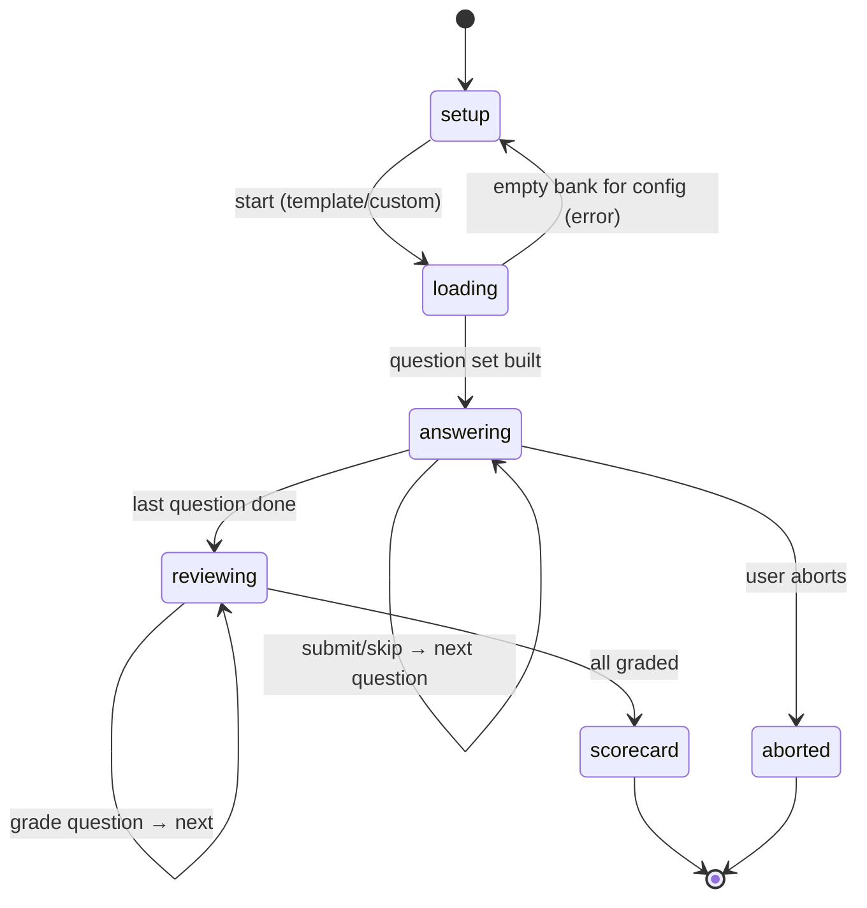

# Flow: Mock Interview (Mode A, in-app, offline)

End-to-end interview rehearsal: setup → timed run (no reveal) → review + self-grade → scorecard. Fully offline, no runtime AI. See `docs/PLAN.md` §C, `issues/005-mock-interview-mode-a.md`.

## Actors

| Actor | Role |
|-------|------|
| User | Candidate rehearsing |
| Web | Next.js client (`app/mock/page.tsx`) — owns ephemeral run state + timers |
| Server | Route handlers `api/mock/start`, `api/answer` |
| DB | SQLite via Prisma (`Question`, `Attempt`, `TopicProgress`) |

No external services. The run (queue, answers, times) lives in client state; only `Attempt`s persist.

## Screens

| Step | Screen | Wireframe |
|------|--------|-----------|
| 1 | Mock setup (template / custom builder) | docs/design/wireframes/mock-setup.md |
| 2 | Timed run (question + timer + answer) | docs/design/wireframes/mock-run.md |
| 3 | Review + self-grade (per question) | docs/design/wireframes/mock-review.md |
| 4 | Scorecard | docs/design/wireframes/mock-scorecard.md |

## State Machine — Run lifecycle (client)



Notes: timer never forces a transition (soft). `answering` → `reviewing` only when the queue empties. Abort is allowed any time during `answering`/`reviewing`; aborted runs write no further Attempts.

## Sequence — Happy Path

```mermaid
sequenceDiagram
    actor User
    participant Web
    participant Server
    participant DB

    User->>Web: pick template / configure custom, click Start
    Web->>Server: POST /api/mock/start { template | config }
    Server->>DB: select ordered question set (prefer unseen)
    Server-->>Web: 200 { items:[{id,prompt,type,choices,topic}] }
    Note over Web: build run state; start total + per-Q timers

    loop each question (no reveal)
        Web-->>User: show prompt + AnswerInput + countdown
        User->>Web: type answer → Submit (or Skip)
        Note over Web: record {answer, timeTakenSec, overTime}; advance
    end

    Note over Web: queue empty → enter review phase
    loop each question
        Web-->>User: reveal model answer + checklist (ChecklistGrade)
        alt MCQ/QUIZ
            Note over Web: auto-score 100/0 vs referenceAnswer
        else other types
            User->>Web: tick covered checklist items → coverage %
        end
        Web->>Server: POST /api/answer { questionId, rating }
        Server->>DB: INSERT Attempt(score, feedback{coverage,timeTakenSec,overTime}); UPDATE TopicProgress(nextDue, avg)
        Server-->>Web: 200 ok
    end

    Web-->>User: scorecard (overall / per-type / per-topic / weak / over-time)
    User->>Web: Done → dashboard
```

## Branches & Error Paths

### B1: Skip a question
Trigger: user clicks Skip in `answering`. No answer captured; question marked `skipped`. In review it still reveals answer + checklist; a skipped non-MCQ defaults coverage 0 (suggested rating Again) unless the user grades it. No Attempt is written for a question the user never engages with → confirm at review: skipped items show but only write an Attempt if graded.

### B2: Over-time (soft timer)
Trigger: per-question countdown reaches 0. Timer keeps running, flips to "＋MM:SS over"; question flagged `overTime=true`. No forced submit. Surfaced on the scorecard.

```mermaid
sequenceDiagram
    actor User
    participant Web
    Note over Web: per-Q countdown hits 0
    Web-->>User: timer shows "over time" (aria-live polite)
    User->>Web: finish answer → Submit
    Note over Web: store overTime=true; continue
```

### B3: Abort run
Trigger: user clicks "End mock" during `answering` or `reviewing`. Confirm modal. On confirm → discard remaining queue. Attempts already written in review stay; no new ones. Route to dashboard (or a partial scorecard for graded items).

### B4: Empty bank for config
Trigger: `api/mock/start` cannot fill the requested set (e.g. a custom type/tier with too few questions). Server returns what it can + a shortfall note, OR 422 if zero. Web shows inline error on setup, keeps choices, suggests loosening filters. (→ `/edge-case-enum`)

### B5: Reload / navigate away mid-run
Run state is client-only and ephemeral → it is lost. Acceptance: warn via `beforeunload` during `answering`/`reviewing`. No resume in v1 (no MockSession tables). Already-written review Attempts persist.

### B6: Answer POST fails during review
Trigger: `POST /api/answer` errors. Web shows retry on that question; does not advance until success or skip. Scorecard notes ungraded items.

## Side Effects Summary

| Step | Side effect |
|------|-------------|
| Start | none persisted (read-only select); client builds run state |
| Per-Q during run | client-only (answer text, time, overTime) |
| Grade in review | INSERT `Attempt`(score, feedback JSON = {rating, coverage, timeTakenSec, overTime}); UPDATE `TopicProgress`(attempts, avgScore, lastSeen, nextDue) |
| Scorecard | none (computed in-memory from the run) |

## Idempotency / consistency
- No mock session row; re-starting builds a fresh set. Acceptable (ephemeral by decision #4).
- Each review grade writes exactly one Attempt; double-submit guarded by disabling the control while the POST is in flight.

## Open Questions
- Skipped-but-ungraded: write a 0-score Attempt or nothing? Default: nothing (don't pollute SR with unseen-effort). Confirm.
- Partial scorecard on abort: show graded-so-far or discard? Default: show graded-so-far.

## Out of Scope
- Persistent mock history / resume (no `MockSession` tables in v1).
- Mode B (`/mock-interview` Claude Code skill) and Mode C bridge — separate.
